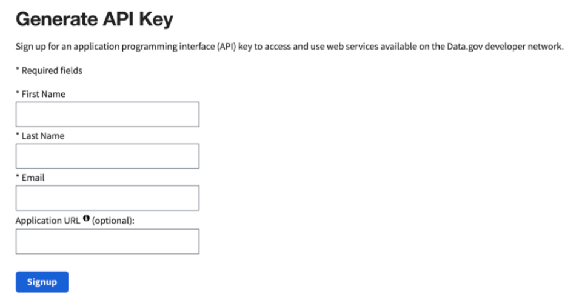
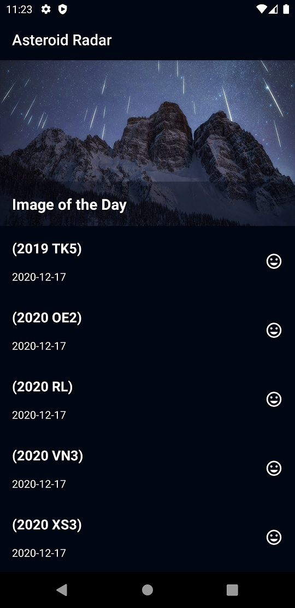
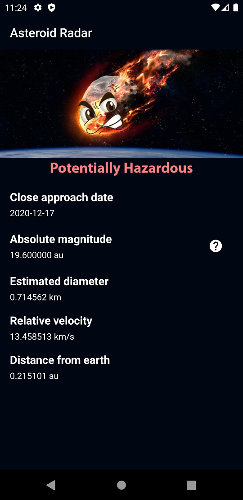
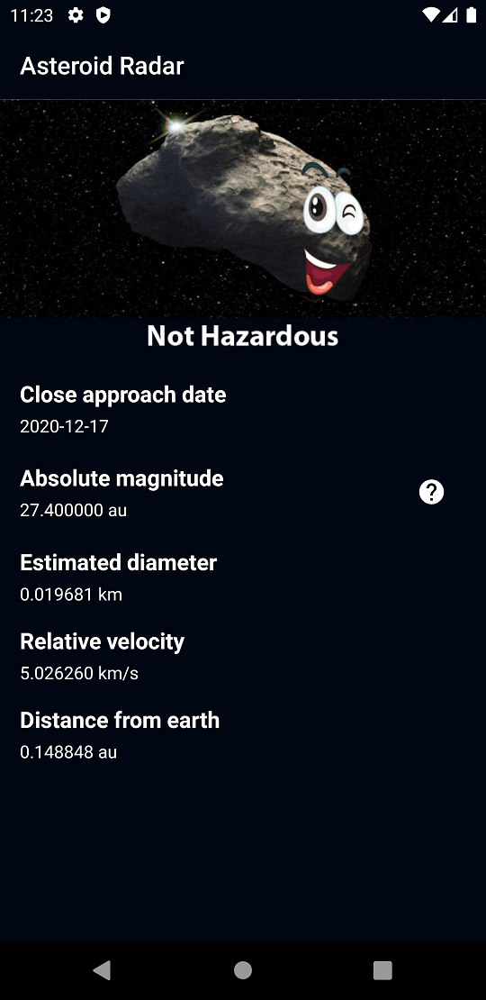

# Note
This app is built as part of the Udacity Android Kotlin Developer Nanodegree program
# get the api key
 To run the app obtain NEoWs API key which is a free, open source API provided by NASA JPL Asteroid team
and paste it in the 'constants' file in the project main directory "const val API_KEY = "<-paste your key here->""
To get the api key go to https://api.nasa.gov/

# App description
Asteroid Radar is an app to view the asteroids close to earth that are detected by Nasa. It shows asteorids given
 a period of time with data such as the size, velocity, distance to earth and if they are potentially hazardous. 
The app also shows the nasa image of the day.

## Main Screen

## Detail Screen - 1

## Detail Screen - 2

